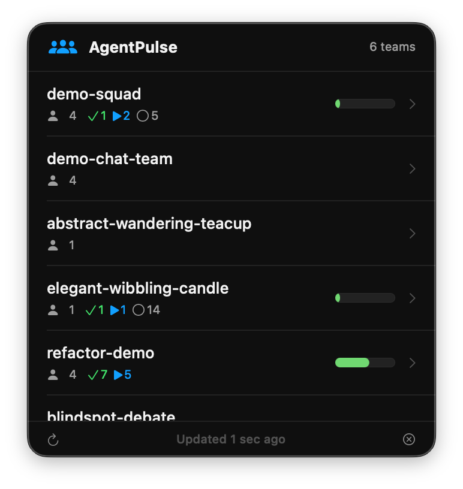

# AgentPulse

A macOS menu bar app that gives you glanceable visibility into your Claude Code agent teams and tasks.



## Why it exists

Claude Code agent teams store their state in `~/.claude/teams/` and `~/.claude/tasks/` as JSON files. There's no native way to see team members, task progress, or blocked work without switching to the terminal and pressing Ctrl+T. AgentPulse surfaces all of this in a single menu bar click.

## Install

```bash
# Clone and build
cd AgentPulse
swiftc -parse-as-library -o AgentPulse AgentPulse.swift

# Create .app bundle (hides dock icon)
mkdir -p AgentPulse.app/Contents/MacOS
cp AgentPulse AgentPulse.app/Contents/MacOS/
cat > AgentPulse.app/Contents/Info.plist << 'EOF'
<?xml version="1.0" encoding="UTF-8"?>
<!DOCTYPE plist PUBLIC "-//Apple//DTD PLIST 1.0//EN" "http://www.apple.com/DTDs/PropertyList-1.0.dtd">
<plist version="1.0">
<dict>
    <key>CFBundleExecutable</key>
    <string>AgentPulse</string>
    <key>CFBundleIdentifier</key>
    <string>com.dailywidgets.agentpulse</string>
    <key>CFBundleName</key>
    <string>AgentPulse</string>
    <key>CFBundleVersion</key>
    <string>0.1.0</string>
    <key>LSUIElement</key>
    <true/>
</dict>
</plist>
EOF

# Launch
open AgentPulse.app
```

## Quickstart

1. Build and launch (see above)
2. Look for the people icon in your menu bar
3. Click it to see all your Claude Code agent teams
4. Click any team to see members and task progress

## What you see

**Team list:**
- All teams from `~/.claude/teams/`
- Member count per team
- Task progress: completed / in-progress / pending counts
- Progress bar showing completion percentage

**Team detail (click a team):**
- Team description and creation date
- Members with model badges (Opus/Sonnet/Haiku) and role icons
- Full task list with status indicators:
  - Green checkmark = completed
  - Blue play = in progress (with active form description)
  - Gray circle = pending
  - Orange lock = blocked by another task
- Task owners and blocking status

**Menu bar icon:**
- Shows people icon + count of in-progress tasks
- Updates every 5 seconds automatically

## Examples

```
# Just run the binary directly (dock icon visible)
./AgentPulse

# Run as .app bundle (no dock icon, recommended)
open AgentPulse.app

# Run parse tests to verify data reading
swift test_parse.swift
```

## Troubleshooting

**No teams showing?**
- AgentPulse reads from `~/.claude/teams/`. If you haven't used Claude Code agent teams, this directory may be empty.

**Tasks not updating?**
- AgentPulse auto-refreshes every 5 seconds. Click the refresh button in the footer for immediate update.

**App doesn't appear in menu bar?**
- Check if it's running: `ps aux | grep AgentPulse`
- Try killing and relaunching: `pkill AgentPulse && open AgentPulse.app`

## Requirements

- macOS 14+ (Sonoma or later)
- Swift 5.9+
- Claude Code with agent teams enabled

## License

MIT
